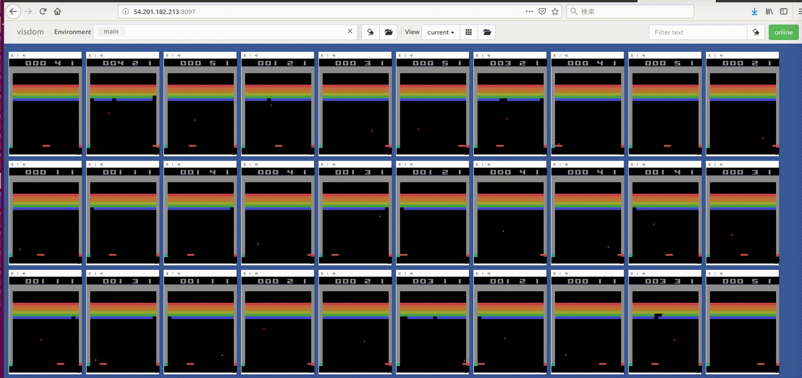
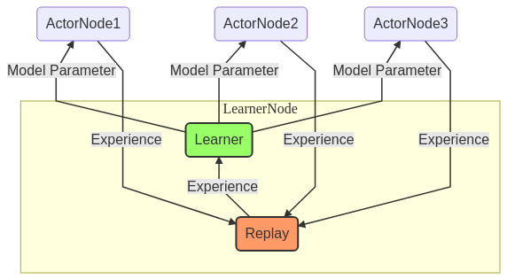

# distributed_rl

This is pytorch implementation of distributed deep reinforcement learning.

* [ape-x](https://arxiv.org/abs/1803.00933)




## System
In our system, there are two processes, Actor and Learner.
In Learner process, thread of the replay memory runs at the same time,
and these processes communicate using Redis.



## Install

```
sudo pip install pipenv
git clone https://github.com/neka-nat/distributed_rl.git
cd distributed_rl
pipenv install
```

```
sudo apt-get install redis-server
```

Edit /etc/redis/redis.conf

```
- bind 127.0.0.1
+ bind 0.0.0.0
```

```
- stop-writes-on-bgsave-error yes
+ stop-writes-on-bgsave-error no
```

Restart redis-server

```
sudo service redis restart
```

## Run

```
pipenv shell
./run.sh <number of actors>
```

## Docker build

```
cd distributed_rl
docker build -t distributed_rl:1.0 .
```

## Use AWS

Set configuration of aws.

```
aws configure
# AWS Access Key ID [None]: *********
# AWS Secret Access Key [None]: *********
# Default region name [None]: us-west-2
# Default output format [None]: json
```

Create AMI.

```
packer build packer/ubuntu.json
```

Create key-pair.

```
aws ec2 create-key-pair --key-name key --query 'KeyMaterial' --output text > ~/.ssh/key.pem
chmod 400 ~/.ssh/key.pem
```

Run instances.

```
cd aws
python aws_run_instances.py
```

Run fabric for a learner.

```
fab -H <Public IP of learner's instance> -u ubuntu -i ~/.ssh/key.pem learner_run
```

Run fabric for actors.

```
fab -P -H <Public IP of actor's instance 1>,<Public IP of actor's instance 2>, ... -u ubuntu -i ~/.ssh/key.pem actor_run:num_proc=15,leaner_host=<Public IP of learner's instance>
```
