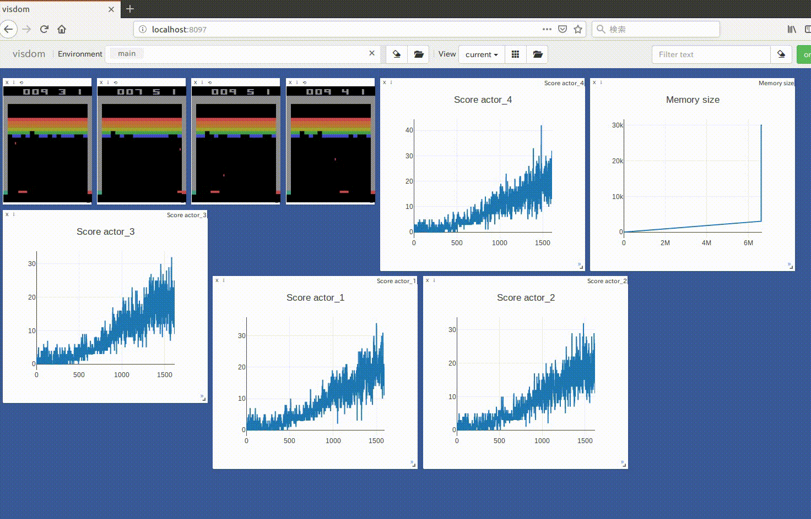

# distributed_rl

This is pytorch implementation of distributed deep reinforcement learning.

* [ape-x](https://arxiv.org/abs/1803.00933)
* [r2d2](https://openreview.net/forum?id=r1lyTjAqYX) (experimental)




## System
In our system, there are two processes, Actor and Learner.
In Learner process, thread of the replay memory runs at the same time,
and these processes communicate using Redis.


## Install

```
sudo pip install pipenv
git clone https://github.com/neka-nat/distributed_rl.git
cd distributed_rl
pipenv install
```

Install redis-server.

```
sudo apt-get install redis-server
```

## Run
The following command is running all actors and learner in localhost.
The number of actor's processes is given as an argument.

```
pipenv shell
./run.sh 4
```

Run r2d2 mode.

```
./run.sh 4 config/all_r2d2.conf
```

## Docker build

```
cd distributed_rl
docker build -t distributed_rl:1.0 .
```

## Use AWS

Create AMI.

```
packer build packer/ubuntu.json
```

Create key-pair.

```
aws ec2 create-key-pair --key-name key --query 'KeyMaterial' --output text > ~/.ssh/key.pem
chmod 400 ~/.ssh/key.pem
```

Run instances.

```
cd aws
python aws_run_instances.py aws_config.yaml
```

Run fabric for a learner.

```
fab -H <Public IP of learner's instance> -u ubuntu -i ~/.ssh/key.pem learner_run
```

Run fabric for actors.

```
fab -H <Public IP of actor's instance 1>,<Public IP of actor's instance 2>, ... -u ubuntu -i ~/.ssh/key.pem actor_run:num_proc=15,leaner_host=<Public IP of learner's instance>
```
